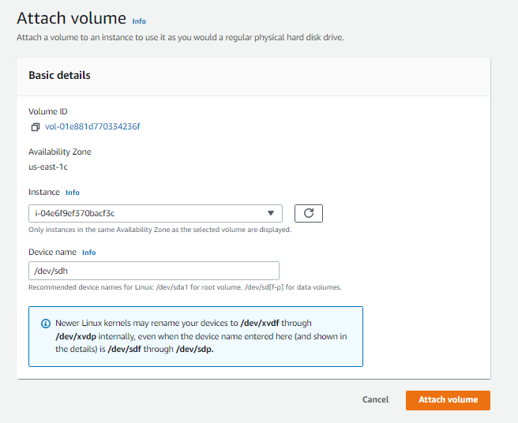
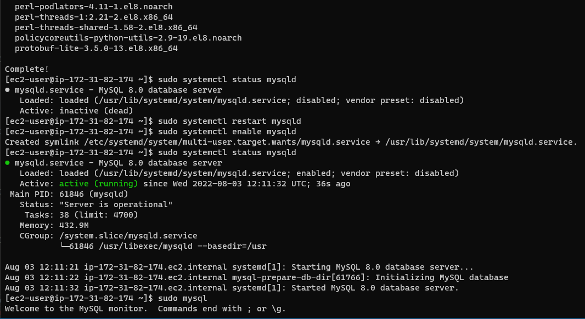

## PROJECT 6: Web Solution With WordPress

This project is tasked to prepare storage infrastructure on two Linux servers and implement a basic web solution using WordPress.

We wil achieve this goal with the two parts below:

1. By Configuring storage subsystem for Web and Database servers based on Linux OS. The focus of this part is to give you practical experience of working with disks, partitions and volumes in Linux.

2. Then, install WordPress and connect it to a remote MySQL database server. This part of the project will solidify the skills of deploying Web and DB tiers of Web solution.

## The follow will be my 3-Tier Setup.
1. My PC to serve as a client
2. An EC2 Redhat Linux Server as a web server (This is where i'll install WordPress)
3. An EC2 Redhat Linux server as a database (DB) server


Started by creating two EC2 instance. One as the "Web Server", while the other serves as the Database server

`project6webserver`

`project6db`





* Next, SSH into the webserver and run `lsblk` command and the result is as shown below:


* Since all devices in Linux reside in ***/dev/*** directory. I ran **`ls /dev/`** to see all 3 created block devices ***xvdf, xvdh, xvdg.***


* And then followed by **`df -h`** to see all mounts and free space on the server


* Follow by using gdisk utility to create a single partition on each of the 3 disks

`sudo gdisk /dev/xvdf`


* Use **`lsblk`** command to see all partitions created


* Install ***lvm2*** package using **`sudo yum install lvm2`**. Run **`sudo lvmdiskscan`** command to check for available partitions.


*  Used **`pvcreate`** utility to mark each of 3 disks as physical volumes (PVs) to be used by LVM

`sudo pvcreate /dev/xvdf1 /dev/xvdg1 /dev/xvdh1`

* I ran all the three together which could have alternatively be done individually and then checked successful creation with the command below:


`sudo pvs`


* Then , I used **`vgcreate`** utility to add all 3 PVs to a volume group (VG). Name the VG webdata-vg

`sudo vgcreate webdata-vg /dev/xvdh1 /dev/xvdg1 /dev/xvdf1`


`sudo vgs`


* Used **`lvcreate`** utility to create 2 logical volumes. apps-lv (Use half of the PV size), and logs-lv Use the remaining space of the PV size. 

NOTE: ***apps-lv*** will be used to store data for the Website while, ***logs-lv*** will be used to store data for logs.

`sudo lvcreate -n apps-lv -L 14G webdata-vg`

`sudo lvcreate -n logs-lv -L 14G webdata-vg`

* Verify the logical volume creation as below:

 `sudo lvs`


* Now, verify the entire setup


`sudo vgdisplay -v #view complete setup - VG, PV, and LV`

Then, run **`sudo lsblk`** or just **`lsblk`** as it gives same result because the ***lsblk*** command can work without sudo


* Used **`mkfs.ext4`** to format the logical volumes with ext4 filesystem

`sudo mkfs -t ext4 /dev/webdata-vg/apps-lv`

`sudo mkfs -t ext4 /dev/webdata-vg/logs-lv`


* Created ***/var/www/html*** directory to store website files

`sudo mkdir -p /var/www/html`

* Also, created ***/home/recovery/logs*** to store backup of log data

`sudo mkdir -p /home/recovery/logs`

* Then, mount ***/var/www/html on apps-lv*** logical volume

`sudo mount /dev/webdata-vg/apps-lv /var/www/html/`


* Used **`rsync`** utility to backup all the files in the log directory ***/var/log*** into ***/home/recovery/logs*** (This is required before mounting the file system)

`sudo rsync -av /var/log/. /home/recovery/logs/`

* Mount ***/var/log on logs-lv*** logical volume. (Note that all the existing data on ***/var/log*** will be deleted. 

`sudo mount /dev/webdata-vg/logs-lv /var/log`

* Restore log files back into ***/var/log*** directory

`sudo rsync -av /home/recovery/logs/. /var/log`

* Update /etc/fstab file so that the mount configuration will persist after restart of the server


run: `sudo blkid`


* Copy the UUID of the device which would then be updated in the ***/etc/fstab*** file

`sudo vi /etc/fstab`

* Next, update ***/etc/fstab*** by pasting the UUID copied as below.


**`UUID=c01dffbe-c990-45bb-a6d6-969538af821d`**

**`UUID=53ee3d4b-7255-4b8d-b30b-850e79b9857e`**


* Test the configuration and reload the daemon with the commands below:

`sudo mount -a`

`sudo systemctl daemon-reload`


* Now, verify the setup by running: `df -h`


## Still on the webserver...

* I updated the repository to start installing wordpress

`sudo yum -y update`


* Also installed ***wget***, ***Apache*** and it’s dependencies


`sudo yum -y install wget httpd php php-mysqlnd php-fpm php-json`


* Start Apache

`sudo systemctl enable httpd`
`sudo systemctl start httpd`


* Installed PHP and it’s depemdencies


`sudo yum install https://dl.fedoraproject.org/pub/epel/epel-release-latest-8.noarch.rpm`

`sudo yum install yum-utils http://rpms.remirepo.net/enterprise/remi-release-8.rpm`

`sudo yum module list php`

`sudo yum module reset php`

`sudo yum module enable php:remi-7.4`

`sudo yum install php php-opcache php-gd php-curl php-mysqlnd`

`sudo systemctl start php-fpm`

`sudo systemctl enable php-fpm`


I got error while running the last command as the current user, so I switched to ***root user*** as per the error message

`setsebool -P httpd_execmem 1`


## Now to the DB server

Started the Database server and ssh into it.


All the steps as for the Webserver were repeated for the DB server too.


But instead of ***apps-lv** I followed documentation and created **db-lv** and mounted it to **/db** directory instead of **/var/www/html/**

* Used lvcreate utility to create 2 logical volumes. **db-lv and logs-lv**

`sudo lvcreate -n db-lv -L 14G webdata-vg`
`sudo lvcreate -n logs-lv -L 14G webdata-vg` 

* Used **mkfs.ext4** to format the logical volumes with ext4 filesystem

`sudo mkfs -t ext4 /dev/webdata-vg/db-lv`
`sudo mkfs -t ext4 /dev/webdata-vg/logs-lv`

* Created **/db** directory to store database files

`sudo mkdir -p /db`

* Created **/home/recovery/logs** to store backup of log data

`sudo mkdir -p /home/recovery/logs`


* Mounted **/db** on **db-lv** logical volume

`sudo mount /dev/webdata-vg/db-lv /db`


* Repeated same steps below as for the Webserver

* Using rsync utility to backup all the files in the log directory **/var/log** into **/home/recovery/** logs

`sudo rsync -av /var/log/. /home/recovery/logs/`

* Mounted **/var/log** on **logs-lv** logical volume.

`sudo mount /dev/webdata-vg/logs-lv /var/log`

* Restore log files back into /var/log directory

`sudo rsync -av /home/recovery/logs/. /var/log`

* Updated **/etc/fstab** file so that the mount configuration will persist after restart of the server

Do `sudo blkid`

* Copy the UUID of the device and update in the **/etc/fstab** file

`sudo vi /etc/fstab`


* *Update **/etc/fstab** by pasting the UUID copied above

`UUID=f6a9581d-c146-4a2b-adf3-d577ec327a7f`

`UUID=92ab1ef6-81b3-4361-9013-e6ead1477a0f`


* Did `sudo less /etc/fstab`


* Test the configuration and reload the daemon:

`sudo mount -a`

`sudo systemctl daemon-reload`

* Verify the set up: 

`df -h`

verify setup df-h


* MySql installed, enabled, and running after the following commands on the DB server.

`sudo yum update`

`sudo yum install mysql-server`

`sudo systemctl status mysqld`

`sudo systemctl restart mysqld`

`sudo systemctl enable mysqld`




* Then, did the following to create a database and user

```
sudo mysql
CREATE DATABASE wordpress;
CREATE USER `alli`@`172.31.84.13` IDENTIFIED BY 'password';
GRANT ALL ON wordpress.* TO `alli`@`172.31.84.13`;
FLUSH PRIVILEGES;
SHOW DATABASES;
select user from mysql.user;
exit
```


* For extra security, I will allow access to the DB server ONLY from the Web Server’s IP address, so in the Inbound Rule configuration I specified the source IP address as **172.31.84.13**


## Back to the Webserver 
* Install MySQL client and test to connect from the Web Server to the DB server by using **mysql-client**

`sudo yum install mysql`

`sudo mysql -u admin -p -h <DB-Server-Private-IP-address>`

`sudo mysql -u admin -p -h 172.31.82.174`

* I confirmed access to DB from Web server and could also see the database


* Enable TCP port 80 in Inbound Rules configuration for your Web Server EC2 (enable from everywhere 0.0.0.0/0)


* I tried to access from the browser with the link to the WordPress http://Web-Server-Public-IP-Address/wordpress/ but I got an error as below

[Wordpress](http://54.204.127.193/wordpress/)


* Using **vi** editor, I then edited **wp-config.php** file to update my **DB name, user name. password and DB host private IP address**.

on web server goto:

`cd /var/www/html/wordpress`

`sudo vi wp-config.php`


* I also updated the bind-address in the DB server as below:


* Now got the expected result


***Project 6 successfully completed!!!***


