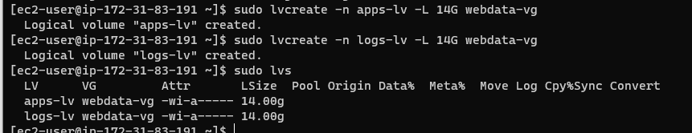

## PROJECT 6: Web Solution With WordPress

This project is tasked to prepare storage infrastructure on two Linux servers and implement a basic web solution using WordPress.

We wil achieve this goal with the two parts below:

1. By Configuring storage subsystem for Web and Database servers based on Linux OS. The focus of this part is to give you practical experience of working with disks, partitions and volumes in Linux.

2. Then, install WordPress and connect it to a remote MySQL database server. This part of the project will solidify the skills of deploying Web and DB tiers of Web solution.

## The follow will be my 3-Tier Setup.
1. My PC to serve as a client
2. An EC2 Redhat Linux Server as a web server (This is where i'll install WordPress)
3. An EC2 Redhat Linux server as a database (DB) server

Started by creating two EC2 instance. One as the "Web Server", while the other serves as the Database server

`plbproj6-web-server`

`pblproj6-database`

volume1-attach.PNG

volume2-attach.PNG

volume3-attach.PNG

lsblk-command.PNG

Since all devices in Linux reside in ***/dev/*** directory. I ran **`ls /dev/`** to see all 3 created block devices ***xvdf, xvdh, xvdg.***

ls-dev.PNG

And then followed by **`df -h`** to see all mounts and free space on the server

sudo-gdisk-dev-xvdf.PNG

xvdf-partition.PNG

xvdg-partition.PNG

xvdh-partition.PNG

**`lsblk`** command to see all partitions created

All-3-partitions.PNG

Install ***lvm2*** package using **`sudo yum install lvm2`**. Run **`sudo lvmdiskscan`** command to check for available partitions.

lvm2-installed-and-scanned.PNG

Used **`pvcreate`** utility to mark each of 3 disks as physical volumes (PVs) to be used by LVM

`sudo pvcreate /dev/xvdf1 /dev/xvdg1 /dev/xvdh1`

I ran all the three together which could have alternatively be done individually

`sudo pvs`

pvscreate-sudopvs.PNG

Used **`vgcreate`** utility to add all 3 PVs to a volume group (VG). Name the VG webdata-vg

`sudo vgcreate webdata-vg /dev/xvdh1 /dev/xvdg1 /dev/xvdf1`

`sudo vgs`

vgroup-sudovgs.PNG

Used **`lvcreate`** utility to create 2 logical volumes. apps-lv (Use half of the PV size), and logs-lv Use the remaining space of the PV size. 

NOTE: ***apps-lv*** will be used to store data for the Website while, ***logs-lv*** will be used to store data for logs.

`sudo lvcreate -n apps-lv -L 14G webdata-vg`

`sudo lvcreate -n logs-lv -L 14G webdata-vg`

`sudo vgdisplay -v #view complete setup - VG, PV, and LV`

Then, run **`sudo lsblk`** or just **`lsblk`** as it gives same result because the ***lsblk*** command can work without sudo

lsblk-sudolsblk.PNG

Used **`mkfs.ext4`** to format the logical volumes with ext4 filesystem

`sudo mkfs -t ext4 /dev/webdata-vg/apps-lv`

`sudo mkfs -t ext4 /dev/webdata-vg/logs-lv`

Created ***/var/www/html*** directory to store website files

`sudo mkdir -p /var/www/html`

Created ***/home/recovery/logs*** to store backup of log data

`sudo mkdir -p /home/recovery/logs`

Mount ***/var/www/html on apps-lv*** logical volume

`sudo mount /dev/webdata-vg/apps-lv /var/www/html/`

Used **`rsync`** utility to backup all the files in the log directory ***/var/log*** into ***/home/recovery/logs*** (This is required before mounting the file system)

`sudo rsync -av /var/log/. /home/recovery/logs/`

Mount ***/var/log on logs-lv*** logical volume. (Note that all the existing data on ***/var/log*** will be deleted. 

`sudo mount /dev/webdata-vg/logs-lv /var/log`

Restore log files back into ***/var/log*** directory

`sudo rsync -av /home/recovery/logs/. /var/log`

Update /etc/fstab file so that the mount configuration will persist after restart of the server

run: `sudo blkid`

Copy the UUID of the device which would then be updated in the ***/etc/fstab*** file

`sudo vi /etc/fstab`

Next, update ***/etc/fstab*** by pasting the UUID copied as below.

**`UUID="e1021776-7f75-46df-950c-e8c746fa2e0a" `**

**`UUID="9aa5a166-6682-4b4a-9614-f806fc39f2b6" `**

Test the configuration and reload the daemon with the commands below:

`sudo mount -a`

`sudo systemctl daemon-reload`

Now, verify the setup by running: `df -h`

Still on the webserver, I updated the repository to start installing wordpress

`sudo yum -y update`

Install ***wget***, ***Apache*** and it’s dependencies

`sudo yum -y install wget httpd php php-mysqlnd php-fpm php-json`

Start Apache

`sudo systemctl enable httpd`
`sudo systemctl start httpd`

Installed PHP and it’s depemdencies

`sudo yum install https://dl.fedoraproject.org/pub/epel/epel-release-latest-8.noarch.rpm`

`sudo yum install yum-utils http://rpms.remirepo.net/enterprise/remi-release-8.rpm`

`sudo yum module list php`

`sudo yum module reset php`

`sudo yum module enable php:remi-7.4`

`sudo yum install php php-opcache php-gd php-curl php-mysqlnd`

`sudo systemctl start php-fpm`

`sudo systemctl enable php-fpm`

I got error while running the last command as the current user, so I switched to ***root user*** as per the error message

`setsebool -P httpd_execmem 1`

MySql installed, enabled, and running

